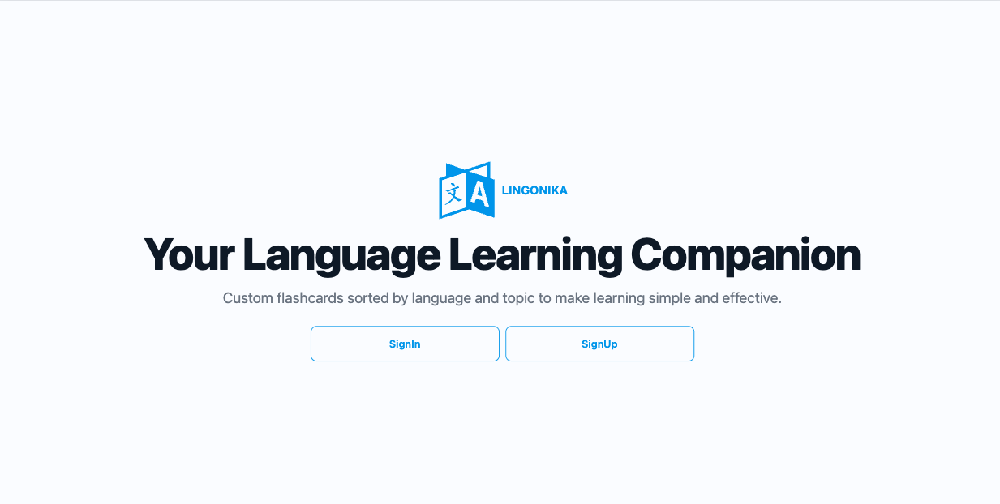
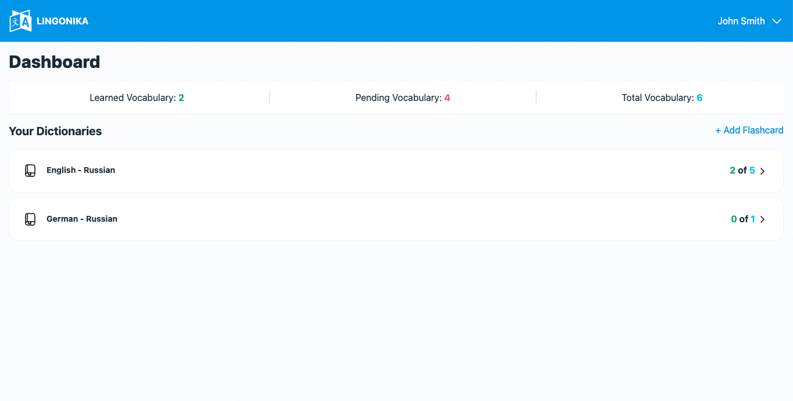
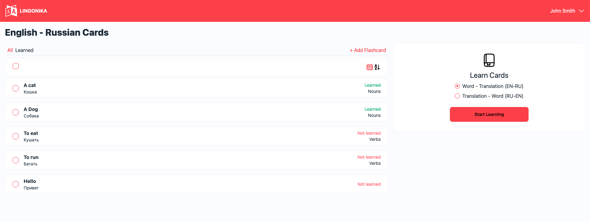
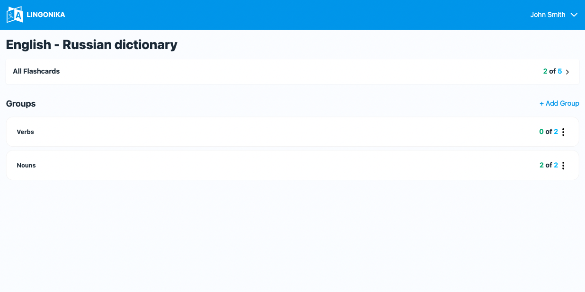
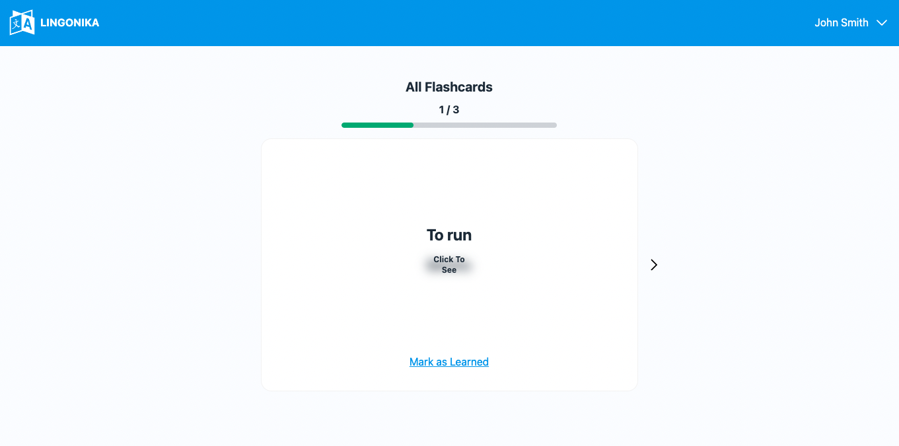

# LINGONIKA

LINGONIKA is your language learning companion. 
Custom flashcards sorted by language and topic to make learning simple and effective.

## 📦 Technologies

- **Backend**: Powered by [NestJS](https://nestjs.com/), using a custom solution package for typical backend tasks: [NestJS Boilerplate](https://github.com/dmitrykologrivko/nestjs-boilerplate)
- **Frontend**: Built with [React](https://reactjs.org/), using a custom package tailored for common frontend needs: [ReactJS Boilerplate](https://github.com/dmitrykologrivko/reactjs-boilerplate)

##  Demo







## 🚀 Setting Up

### Install

* Node.js (v20.14.0 or higher)
* NPM (v10.7.0 or higher)
* PostgreSQL (v17 or higher)

### Then locally

```
$ export SECRET_KEY=your_secret_key_for_backend_here
$ npm install
$ npm run migrate
$ npm run start-dev
```

### Then on production

```
$ export SECRET_KEY=your_secret_key_for_backend_here
$ npm install
$ npm run deploy
$ npm run migrate
$ npm run start
```

## Alternative Setting Up

### Install

* Docker (v27.4.0 or higher)

### Then

```
$ echo "SECRET_KEY=your_secret_key_for_backend_here" > .env.docker
$ docker-compose up -d
```

## 👨‍💻 Developed By

Dmitry Kologrivko  - <dmitrykologrivko@gmail.com>
