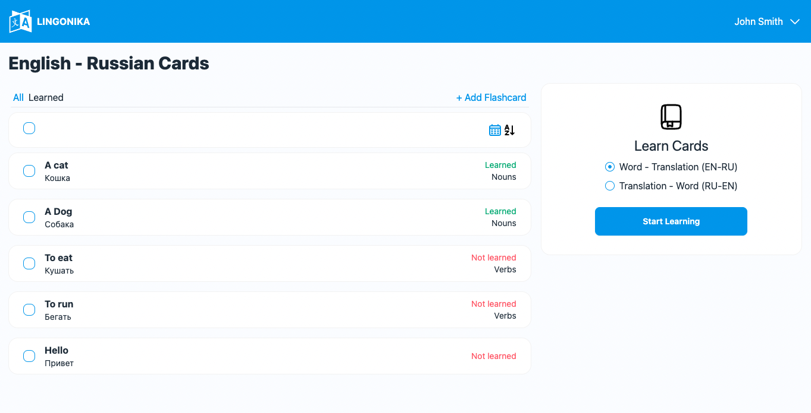

# IT-Сообщество Ставрополя

LINGONIKA is your language learning companion. 
Custom flashcards sorted by language and topic to make learning simple and effective.

##  Demo




## Setting Up

### Install

* Node.js (v20.14.0 or higher)
* NPM (v10.7.0 or higher)
* PostgreSQL (v17 or higher)

### Then locally

```
$ npm install
$ npm run migrate
$ npm run start-dev
```

### Then on production

```
$ npm install
$ npm run deploy
$ npm run migrate
$ npm run start
```

## Alternative Setting Up

### Install

* Docker (v27.4.0 or higher)

### Then

```
$ docker-compose up -d
```

## Developed By

Dmitry Kologrivko  - <dmitrykologrivko@gmail.com>
